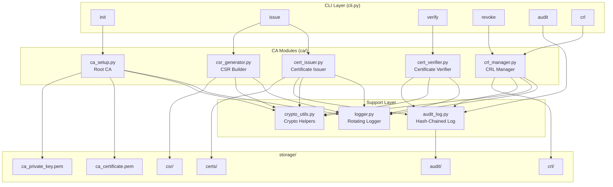
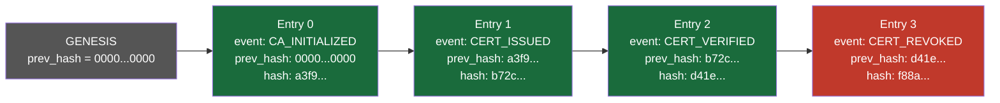
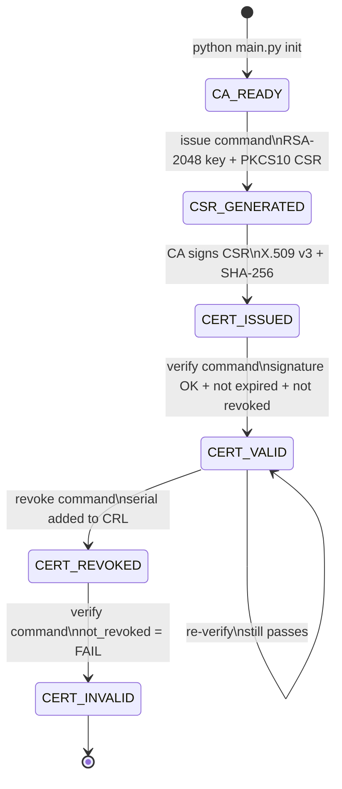
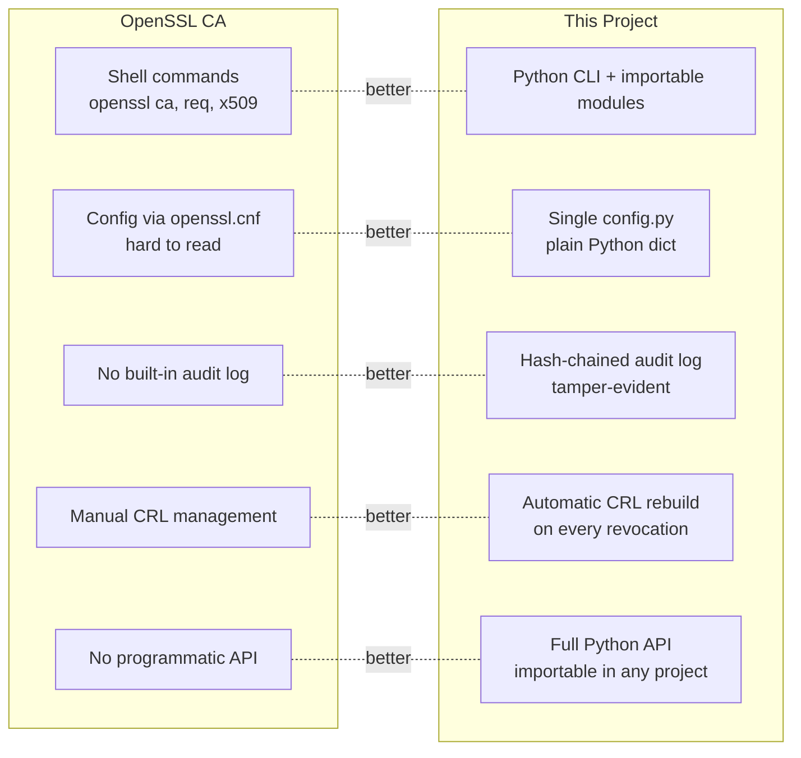
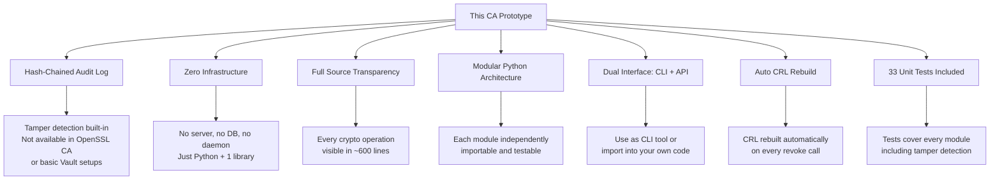

# Digital Certificate Authority (CA) Prototype

A fully functional **Public Key Infrastructure (PKI)** prototype built in Python using the `cryptography` library. This project simulates a real-world Certificate Authority — from root CA setup to certificate issuance, verification, revocation, and tamper-evident audit logging.

---

## Table of Contents

- [What This Project Does](#what-this-project-does)
- [Project Structure](#project-structure)
- [Cryptography & Security Algorithms Used](#cryptography--security-algorithms-used)
- [System Architecture](#system-architecture)
- [Data Flow Diagrams](#data-flow-diagrams)
- [Module Breakdown](#module-breakdown)
- [Installation](#installation)
- [How to Run](#how-to-run)
- [CLI Reference](#cli-reference)
- [Full Walkthrough](#full-walkthrough)
- [Running Tests](#running-tests)
- [Storage Layout](#storage-layout)
- [Security Design Decisions](#security-design-decisions)
- [How This Differs From Existing Systems](#how-this-differs-from-existing-systems)

---

## What This Project Does

This project implements a **Certificate Authority system** — the backbone of HTTPS, email signing, VPNs, and digital identity. It covers the complete certificate lifecycle:

| Stage | Description |
|---|---|
| CA Setup | Generate RSA root key pair + self-signed X.509 v3 certificate |
| CSR Generation | Requester generates their own key pair and submits a Certificate Signing Request |
| Certificate Issuance | CA verifies the CSR and signs a certificate binding identity to public key |
| Certificate Verification | Verify signature, expiry, and revocation status |
| Revocation | Revoke compromised certificates via CRL (Certificate Revocation List) |
| Audit Logging | Every CA action is recorded in a hash-chained, tamper-evident log |

---

## Project Structure

```
digital_ca/
├── main.py                  # Entry point — delegates to CLI
├── cli.py                   # Argparse CLI (init, issue, verify, revoke, audit, crl)
├── config.py                # Central configuration (paths, subject fields, key settings)
├── logger.py                # Centralized rotating logger with console + file handlers
├── requirements.txt
│
├── ca/
│   ├── ca_setup.py          # Root CA key generation + self-signed certificate
│   ├── csr_generator.py     # PKCS#10 CSR creation for certificate requesters
│   ├── cert_issuer.py       # Signs CSRs → issues X.509 v3 certificates
│   ├── cert_verifier.py     # Verifies signature, expiry, revocation
│   └── crl_manager.py       # Certificate Revocation List management
│
├── audit/
│   └── audit_log.py         # SHA-256 hash-chained append-only audit log
│
├── utils/
│   └── crypto_utils.py      # Shared helpers: key gen, serialization, file I/O
│
├── storage/
│   ├── ca_private_key.pem   # Encrypted CA private key (AES-256)
│   ├── ca_certificate.pem   # Root CA certificate (public)
│   ├── certs/               # Issued end-entity certificates
│   ├── csr/                 # Submitted CSRs + requester private keys
│   ├── crl/                 # CRL file + revoked serial registry
│   └── audit/               # audit_log.json + ca_system.log
│
└── tests/
    └── test_ca.py           # 33 unit tests across all modules
```

---

## Cryptography & Security Algorithms Used

### 1. RSA-2048 — Asymmetric Key Generation
- Used for: CA key pair, requester key pairs
- Public exponent: `65537` (Fermat prime — standard for RSA)
- Key size: `2048 bits` (NIST recommended minimum)
- Where: `utils/crypto_utils.py → generate_rsa_key()`

### 2. SHA-256 — Hashing & Certificate Signing
- Used for: Signing certificates, signing CRLs, signing CSRs
- Algorithm: `SHA-256` with `PKCS#1 v1.5` padding
- Output: 256-bit digest
- Where: All `.sign(key, hashes.SHA256())` calls

### 3. X.509 v3 — Certificate Standard
- Used for: Structure of all issued certificates and the root CA cert
- Extensions implemented:
  - `BasicConstraints` — marks CA vs end-entity
  - `KeyUsage` — restricts what the key can be used for
  - `ExtendedKeyUsage` — CLIENT_AUTH, EMAIL_PROTECTION
  - `SubjectKeyIdentifier` — fingerprint of the subject's public key
  - `AuthorityKeyIdentifier` — fingerprint of the signing CA's key
- Where: `ca/ca_setup.py`, `ca/cert_issuer.py`

### 4. PKCS#10 — Certificate Signing Request Format
- Used for: Requesters submitting their public key + identity to the CA
- The CSR is self-signed by the requester's private key (proves key ownership)
- Where: `ca/csr_generator.py`

### 5. PKCS#1 v1.5 — RSA Signature Padding
- Used for: Verifying certificate signatures during verification
- Where: `ca/cert_verifier.py → _check_signature()`

### 6. AES-256 (via BestAvailableEncryption) — Private Key Encryption at Rest
- Used for: Encrypting CA private key and requester private keys before saving to disk
- The `cryptography` library selects AES-256-CBC with PBKDF2 key derivation
- Where: `utils/crypto_utils.py → serialize_private_key()`

### 7. SHA-256 Hash Chain — Tamper-Evident Audit Log
- Used for: Linking audit log entries so any modification is detectable
- Each entry stores: `prev_hash` (hash of previous entry) + `hash` (hash of this entry)
- Tampering with any entry breaks all subsequent hashes
- Where: `audit/audit_log.py`

### 8. X.509 CRL (Certificate Revocation List)
- Used for: Publishing a signed list of revoked certificate serials
- Signed by the CA key using SHA-256
- Includes: `CRLNumber`, `AuthorityKeyIdentifier`, per-entry `CRLReason`
- Where: `ca/crl_manager.py`

---

## System Architecture



---
### Audit Hash Chain



> If any entry is modified, its hash changes — breaking the `prev_hash` link of every entry after it. Detected instantly by `audit.verify_chain()`.

---

### Complete Certificate Lifecycle



---

## Module Breakdown

### `ca/ca_setup.py` — CertificateAuthority
| Method | Description |
|---|---|
| `initialize()` | Smart entry point — loads existing CA or generates new one |
| `generate_root_ca()` | RSA-2048 key + self-signed X.509 v3 cert |
| `load_ca()` | Loads encrypted key + cert from disk |
| `_build_root_cert()` | Constructs cert with all X.509 v3 extensions |
| `_persist()` | Saves key (0o600, encrypted) + cert (0o644) |

### `ca/csr_generator.py` — CSRGenerator
| Method | Description |
|---|---|
| `generate_key_pair()` | RSA-2048 private key for the requester |
| `build_csr(key)` | PKCS#10 CSR signed with requester's key |
| `save(key, csr, name)` | Persists key (encrypted) + CSR to storage/csr/ |
| `_validate_subject()` | Ensures all required subject fields are present |

### `ca/cert_issuer.py` — CertificateIssuer
| Method | Description |
|---|---|
| `issue(csr, days, name)` | Full pipeline: verify CSR → build cert → save → audit |
| `_verify_csr_signature()` | Rejects tampered CSRs before signing |
| `_build_certificate()` | X.509 v3 cert with all extensions, signed by CA |

### `ca/cert_verifier.py` — CertificateVerifier
| Method | Description |
|---|---|
| `verify(cert)` | Runs all 3 checks, returns VerificationResult |
| `_check_signature()` | PKCS1v15 + SHA-256 against CA public key |
| `_check_expiry()` | Compares validity window to current UTC time |
| `_check_revocation()` | O(1) lookup in CRL registry |

### `ca/crl_manager.py` — CRLManager
| Method | Description |
|---|---|
| `revoke(serial, reason)` | Adds to registry, rebuilds CRL, logs audit |
| `is_revoked(serial)` | Fast boolean check |
| `get_revocation_info(serial)` | Returns reason + timestamp |
| `build_and_save_crl()` | Builds signed X.509 CRL, saves to disk |

### `audit/audit_log.py` — AuditLog
| Method | Description |
|---|---|
| `log(event, data)` | Appends hash-chained entry to log |
| `verify_chain()` | Re-hashes all entries, confirms integrity |
| `get_log()` | Returns all entries as list |
| `_compute_hash()` | SHA-256 over canonical JSON of entry |

---

## Installation

```bash
# 1. Navigate to project directory
cd C:\Users\richa\OneDrive\CYS\digital_ca

# 2. Install dependencies
pip install -r requirements.txt

# 3. Install test runner
pip install pytest
```

`requirements.txt` contains:
```
cryptography>=42.0.0
```

---

## How to Run

### Step 1 — Initialize the Root CA
```bash
python main.py init
```
- First run: generates RSA-2048 key + self-signed root certificate, saves to `storage/`
- Subsequent runs: loads existing CA from disk (idempotent)

### Step 2 — Issue a Certificate
```bash
python main.py issue --name "Alice Smith" --email alice@example.com
```
Note the serial number printed — you need it for verify and revoke.

### Step 3 — Verify a Certificate
```bash
python main.py verify --cert storage\certs\alice_smith_<serial>.pem
```

### Step 4 — Revoke a Certificate
```bash
python main.py revoke --serial <serial> --reason key_compromise
```

### Step 5 — Verify Again (should now fail)
```bash
python main.py verify --cert storage\certs\alice_smith_<serial>.pem
```

### Step 6 — View Audit Log
```bash
python main.py audit
```

### Step 7 — View CRL
```bash
python main.py crl
```

---

## CLI Reference

```
usage: ca [-h] {init,issue,verify,revoke,audit,crl} ...

Commands:
  init                     Initialize or display the Root CA
  issue                    Issue a new certificate
  verify                   Verify a certificate file
  revoke                   Revoke a certificate by serial number
  audit                    Display and verify the audit log
  crl                      Rebuild and display the CRL
```

### `issue` options
```
--name      Required  Common name (e.g. "Alice Smith")
--email     Required  Email address
--org                 Organization          (default: Example Corp)
--org-unit            Organizational unit   (default: Engineering)
--country             2-letter country code (default: US)
--state               State                 (default: California)
--locality            City                  (default: San Francisco)
--days                Validity in days      (default: 365)
```

### `revoke` options
```
--serial    Required  Certificate serial number
--reason              Revocation reason (default: unspecified)

Valid reasons:
  unspecified | key_compromise | ca_compromise | affiliation_changed
  superseded  | cessation_of_operation | privilege_withdrawn
```

---

## Full Walkthrough

```bash
# Initialize CA
python main.py init

# Issue certificates for two users
python main.py issue --name "Alice Smith" --email alice@example.com
python main.py issue --name "Bob Jones"   --email bob@example.com --days 730

# Verify both (both should be VALID)
python main.py verify --cert storage\certs\alice_smith_<serial>.pem
python main.py verify --cert storage\certs\bob_jones_<serial>.pem

# Revoke Alice's certificate
python main.py revoke --serial <alice_serial> --reason key_compromise

# Verify again
# Alice → INVALID (not_revoked: FAIL)
# Bob   → VALID
python main.py verify --cert storage\certs\alice_smith_<serial>.pem
python main.py verify --cert storage\certs\bob_jones_<serial>.pem

# View full audit trail
python main.py audit

# View CRL
python main.py crl
```

---

## Running Tests

```bash
python -m pytest tests/test_ca.py -v
```

### Test Coverage — 33 tests across 7 classes

| Test Class | Tests | What is Verified |
|---|---|---|
| `TestCASetup` | 7 | RSA-2048 key, self-signed cert, X.509 extensions, disk save, reload, validity period |
| `TestCSRGenerator` | 4 | CSR signature, subject fields, missing field error, file persistence |
| `TestCertificateIssuer` | 5 | Signed by CA, not a CA cert, validity days, disk save, audit entry created |
| `TestCertificateVerifier` | 4 | Valid cert passes, wrong CA fails, revoked cert fails, audit entry created |
| `TestCRLManager` | 6 | Revoke, double-revoke idempotent, invalid reason raises, CRL file created, revocation info, audit entry |
| `TestAuditLog` | 4 | Chain intact after events, tamper detection, required fields, sequential seq numbers |
| `TestCLI` | 3 | init, issue, audit commands via CLI |

Expected output:
```
33 passed in ~8s
```

---

## Storage Layout

```
storage/
├── ca_private_key.pem          # RSA-2048 CA private key (AES-256 encrypted)
├── ca_certificate.pem          # Self-signed root CA certificate (public)
├── certs/
│   └── <name>_<serial>.pem     # Issued end-entity certificates
├── csr/
│   ├── <name>_csr.pem          # PKCS#10 Certificate Signing Requests
│   └── <name>_private_key.pem  # Requester private keys (AES-256 encrypted)
├── crl/
│   ├── ca.crl.pem              # Signed X.509 Certificate Revocation List
│   └── revoked_registry.json   # Fast-lookup revocation registry
└── audit/
    ├── audit_log.json          # Hash-chained event log
    └── ca_system.log           # Rotating system log (5MB x 3 backups)
```

---

## Security Design Decisions

| Decision | Reason |
|---|---|
| RSA-2048 with e=65537 | NIST-recommended minimum; Fermat prime exponent is efficient and secure |
| SHA-256 for all signatures | Collision-resistant; SHA-1 is deprecated for certificates since 2017 |
| `BestAvailableEncryption` for private keys | Uses AES-256-CBC + PBKDF2 — keys are never stored in plaintext |
| File permissions `0o600` for private keys | Owner read/write only — prevents other OS users from reading keys |
| CSR signature verified before issuance | Prevents a third party from submitting a CSR with someone else's public key |
| `BasicConstraints(ca=False)` on end-entity certs | Prevents issued certs from being used to sign other certificates |
| Hash-chained audit log | Any modification to a past entry breaks all subsequent hashes — tamper-evident |
| Serial numbers as CRL keys | Matches X.509 standard; serials are unique per CA |
| Revocation registry JSON + CRL PEM | Registry for fast O(1) lookup; CRL PEM for standard X.509 interoperability |
| Dependency injection for AuditLog | Every module logs independently without tight coupling |

---

## How This Differs From Existing Systems

Real-world CA systems like **OpenSSL CA**, **EJBCA**, **Vault PKI**, and **Microsoft ADCS** are production-grade tools built for enterprise scale. This project is a **transparent, educational prototype** — every layer is visible, readable, and modifiable. Here is a precise comparison:

---

### vs OpenSSL CA (`openssl ca` command)



| Feature | OpenSSL CA | This Project |
|---|---|---|
| Interface | Shell commands | Python CLI + API |
| Configuration | `openssl.cnf` (complex INI format) | `config.py` (plain Python dict) |
| Audit logging | None built-in | Hash-chained, tamper-evident |
| CRL management | Manual rebuild required | Auto-rebuilt on every revocation |
| Programmatic use | Not possible | Fully importable Python modules |
| Transparency | Binary/opaque internals | Every step readable in source |
| Learning curve | High (many flags, file formats) | Low (6 CLI commands) |

---

### vs EJBCA (Enterprise Java Beans CA)

| Feature | EJBCA | This Project |
|---|---|---|
| Deployment | Java EE application server | Single Python script |
| Setup time | Hours (JBoss/WildFly + DB) | 2 minutes (`pip install`) |
| Interface | Web GUI + REST API | CLI + Python API |
| Database | PostgreSQL / MySQL required | JSON files (zero dependencies) |
| Audit log | Database-backed | Hash-chained JSON (portable) |
| Use case | Enterprise PKI (millions of certs) | Education, prototyping, research |
| Source visibility | 500k+ lines of Java | ~600 lines of Python |

---

### vs HashiCorp Vault PKI Secrets Engine

| Feature | Vault PKI | This Project |
|---|---|---|
| Infrastructure | Vault server + storage backend | No server — runs locally |
| Auth model | Token / AppRole / Kubernetes | None (local filesystem) |
| Secret storage | Encrypted Vault storage | AES-256 encrypted PEM files |
| Audit log | Vault audit devices (syslog/file) | SHA-256 hash-chained JSON |
| CRL | Auto-managed | Auto-rebuilt on revocation |
| API | HTTP REST | Python function calls + CLI |
| Transparency | Closed runtime | Full source — every line visible |

---

### vs Microsoft Active Directory Certificate Services (ADCS)

| Feature | ADCS | This Project |
|---|---|---|
| Platform | Windows Server only | Cross-platform (Windows/Linux/Mac) |
| Setup | GUI wizard + domain join | `pip install cryptography` |
| Integration | Active Directory dependent | Standalone — no dependencies |
| Audit log | Windows Event Log | Hash-chained JSON |
| Scripting | PowerShell cmdlets | Python API |
| Cost | Windows Server license | Free / open source |

---

### Key Differentiators of This Project



---

### What This Project Does NOT Do (by design)

These are intentional omissions — this is a prototype, not a production system:

| Missing Feature | Production System That Has It | Why Omitted Here |
|---|---|---|
| OCSP (Online Certificate Status Protocol) | All major CAs, Vault PKI | Requires HTTP server; out of scope |
| Intermediate CA / CA hierarchy | EJBCA, ADCS, OpenSSL | Adds complexity; root CA sufficient for prototype |
| HSM (Hardware Security Module) support | EJBCA, ADCS, Vault | Hardware dependency; not portable |
| Certificate templates / profiles | ADCS, EJBCA | Simplified to single end-entity profile |
| Web GUI | EJBCA, ADCS | CLI is sufficient for prototype |
| Multi-user access control | Vault, EJBCA | Single-operator model |
| Database backend | EJBCA, ADCS | JSON files keep it dependency-free |
| Automated certificate renewal | Vault, ACME/Let's Encrypt | Manual re-issue is sufficient here |

---

### Summary

> This project sits in a unique position: it is **more transparent than OpenSSL**, **simpler than EJBCA or Vault**, **cross-platform unlike ADCS**, and **adds a hash-chained audit log that none of the above provide out of the box**. It is purpose-built for understanding, teaching, and prototyping PKI — not for replacing production CA infrastructure.
